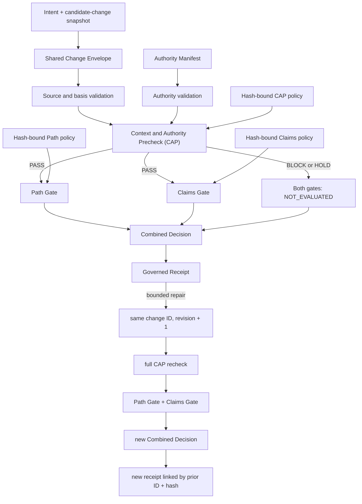

# Architecture

## Boundary

This repository is a standalone deterministic prototype. It evaluates a
declared candidate-change snapshot; it does not inspect or mutate a live Git
repository. It uses the Python standard library and does not call Git, hooks,
models, providers, credentials, networks, or external services.

Architecture is not execution. A `PASS` decision means the declared snapshot
passed these declared checks. It is not permission to apply the change.

## Components

| Component | Responsibility |
| --- | --- |
| Shared Change Envelope | Binds the logical change, revision, source basis, proposed snapshot, claims, policies, and evidence requirements |
| Authority Manifest | Presents actor, task, path, action, time, no-touch, and gate limits |
| Context and Authority Precheck (CAP) | Determines whether the proposal is admissible for policy evaluation |
| Path Gate | Checks where and how the declared change writes |
| Claims Gate | Checks what the declared affected material asserts |
| Combined Decision | Produces one deterministic fail-closed disposition |
| Governed Receipt | Preserves inputs, policies, evidence, decision, limitations, and lineage |

The public CAP label is **Context and Authority Precheck**. Stable generated
compatibility text retains limited internal source-project identifiers where
changing the strings would alter verified deterministic evidence. Those
identifiers do not create a dependency or change the exported mechanical
stage.

## Executable flow

No repaired revision may resume directly at a domain gate.

## CAP boundary

CAP mechanically checks:

- declared source/base hash against the required basis;
- exact task, path, and action containment within presented authority;
- no-touch intersection;
- authority validity at the supplied `evaluation_as_of`;
- declared evidence presence and closed availability state;
- recognized contract and policy versions;
- required-gate sufficiency; and
- canonical policy hashes.

CAP does not:

- prove that the authority issuer has real-world standing;
- judge wisdom, usefulness, strategy, or commercial value;
- make open-ended semantic judgments;
- grant or expand authority;
- execute a change;
- replace either domain gate; or
- convert a domain-gate failure into `PASS`.

CAP outcomes are `PASS`, `BLOCK`, and
`HOLD:CONTEXT_UPDATE_REQUIRED`.

If CAP is `BLOCK` or `HOLD`, both domain gates produce canonical
`NOT_EVALUATED / CAP_NOT_PASSED` records. A skipped gate is never represented
as `PASS`.

## Gate heterogeneity

The gates share a strict Gate Result envelope while preserving distinct
evidence:

| Gate | Question | Evidence |
| --- | --- | --- |
| Path Gate | Where may the change write? | canonical paths, operations, allowed scope, denied prefixes, rename endpoints |
| Claims Gate | What may the affected material assert? | claim inventory, claim-bearing extracts, evidence classes/states, qualifiers, limitations |

The Claims Gate applies closed deterministic rules. It does not determine
arbitrary factual truth or inspect omitted prose.

## Decision precedence

The reducer applies this order:

1. Invalid contract or unknown required policy -> `BLOCK`
2. Invalid, expired, revoked, or unknown authority -> `BLOCK`
3. CAP `BLOCK` -> `BLOCK`
4. CAP `HOLD:CONTEXT_UPDATE_REQUIRED` -> `HOLD`
5. Any required gate `BLOCK` -> `BLOCK`
6. Any required gate `HOLD` -> `HOLD`
7. Any required gate unexpectedly `NOT_EVALUATED` -> `BLOCK`
8. All required applicable gates `PASS` -> `PASS`
9. Anything else -> `BLOCK`

## Determinism

Identity is computed from:

- fixed candidate inputs;
- canonical CAP, Path, and Claims policy bytes;
- evaluator and contract versions; and
- supplied `evaluation_as_of`.

Canonical JSON uses UTF-8, sorted object keys, compact separators, LF line
endings, and no wall-clock timestamps. Every policy carries an ID, version,
and content hash. The same version label with different bytes therefore has a
different identity.

## Receipt meaning

One consolidated receipt is emitted per revision. The repaired receipt
preserves:

- the same logical change ID;
- an incremented revision;
- a new envelope hash;
- a new CAP decision;
- the prior receipt ID and full hash;
- a repair summary; and
- unchanged policy hashes where applicable.

Receipts are diagnostic evidence for the declared evaluation. They are not
signatures, self-certifying proof, security guarantees, or execution
authority.
